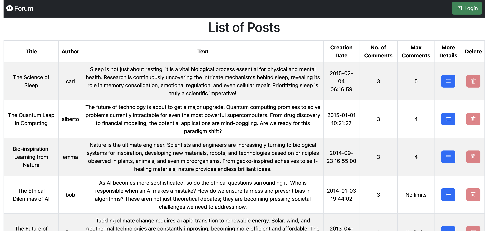
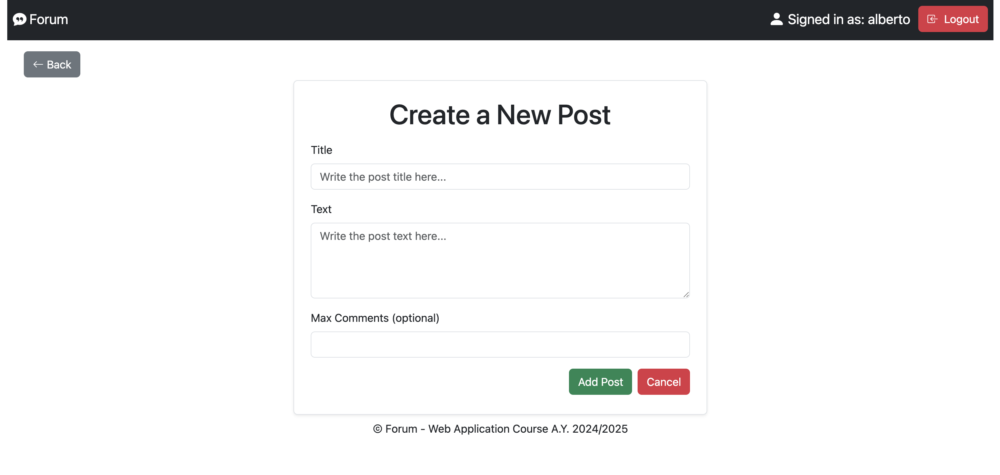
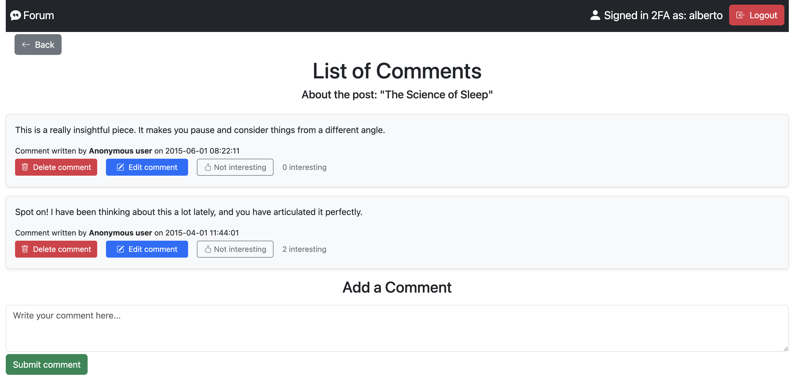

# "Forum"

## React Client Application Routes

- Route `/`  
  - **Page content and purpose**: home page that displays the list of all forum posts. Authenticated users can add new posts

- Route `/post/:postId`  
  - **Page content and purpose**: displays the list of comments for the post identified by `postId`. Authenticated users can see all comments (including non-anonymous ones), mark them as interesting, and edit or delete their own comments
  - **Param**: `postId`, the ID of the post whose comments are being displayed

- Route `/add`  
  - **Page content and purpose**: form page to create a new post. Accessible only to authenticated users

- Route `/login`  
  - **Page content and purpose**: login page. If the user is an admin with 2FA enabled and hasn’t completed verification, a TOTP input form is shown

- Route `/*`  
  - **Page content and purpose**: catch-all route for undefined paths. Displays an error message and a link to return to the home page

## API Server

- **GET** `/api/posts`  
  - **Description**: retrieve the full list of posts, including title, content, publication date, author, maximum number of comments (if any), and current number of comments
  - **Authentication not needed**  
  - **Request body**: _None_  
  - **Response**: `200 OK` (success)  
  - **Response body**: JSON array of post objects, each including metadata about the post  

    ```json
    [
      {
        "id": 6,
        "title": "The Science of Sleep",
        "text": "Sleep is not just about resting; it is a vital biological process essential for physical and mental health...",
        "maxComments": 5,
        "username": "carl",
        "date": "2015-02-04 06:16:59",
        "commentCount": 3
      },
      {
        "id": 1,
        "title": "The Quantum Leap in Computing",
        "text": "The future of technology is about to get a major upgrade...",
        "maxComments": 4,
        "username": "alberto",
        "date": "2015-01-01 10:21:27",
        "commentCount": 3
      }
      // ... other posts ...
    ]
    ```

  - **Error response**: `500 Internal Server Error` – unexpected server error while retrieving posts from the database

- **GET** `/api/posts/:id`  
  - **Description**: retrieve the details of a single post identified by its ID, including title, content, publication date, author, maximum number of comments (if any), and current number of comments
  - **Authentication not needed**  
  - **Request body**: _None_  
  - **Response**: `200 OK` (success)  
  - **Response body**: JSON object containing all metadata about the post  

    ```json
    {
      "id": 1,
      "title": "The Quantum Leap in Computing",
      "text": "The future of technology is about to get a major upgrade. Quantum computing promises to solve problems currently intractable for even the most powerful supercomputers...",
      "maxComments": 4,
      "username": "alberto",
      "date": "2015-01-01 10:21:27",
      "commentCount": 3
    }
    ```

  - **Error response**:
    - `404 Not Found` – if no post with the given ID exists
    - `422 Unprocessable Entity` – if the provided post ID is missing or invalid (e.g., non-numeric or less than 1)
    - `500 Internal Server Error` – unexpected server error while retrieving the post

- **GET** `/api/posts/:id/comments`  
  - **Description**: retrieve the list of comments associated with the post identified by ID, including author (if any), content, timestamp, number of “interesting” flags, and whether the current user has marked the comment as interesting
  - **Authentication required** (to see all comments), **Authentication not required** (to see only anonymous comments)
  - **Request body**: _None_  
  - **Response**: `200 OK` (success)  
  - **Response body**: JSON array of comment objects including related metadata, sorted by timestamp in descending order

    ```json
    [
      {
        "id": 2,
        "text": "Great points raised here. So much to consider.",
        "username": null,
        "date": "2015-10-04 14:44:56",
        "interestingCount": 0,
        "markedByMe": false
      }
      // ... other comments ...
    ]
    ```

  - **Error response**:
    - `422 Unprocessable Entity` – if the provided post ID is missing or invalid (e.g., non-numeric or less than 1)
    - `500 Internal Server Error` – unexpected server error while retrieving the comments

- **POST** `/api/posts`  
  - **Description**: create a new post with the given title, text, and optional maximum number of comments. The author and timestamp are set automatically based on the authenticated user and system time
  - **Authentication required**  
  - **Request body**: JSON object with post data  

    ```json
    {
      "title": "The Silent Language of Trees",
      "text": "Did you know trees communicate? Far from being isolated entities, trees form intricate networks underground through fungi, often called the Wood Wide Web.",
      "maxComments": 5
    }
    ```

  - **Response**: `201 Created` (post successfully created)  
  - **Response body**: JSON object containing the newly created post data

    ```json
    {
      "id": 10,
      "title": "The Silent Language of Trees",
      "text": "Did you know trees communicate? Far from being isolated entities, trees form intricate networks underground through fungi, often called the Wood Wide Web.",
      "maxComments": 5,
      "username": "alberto",
      "date": "2025-06-15 09:46:31",
      "commentCount": 0
    }
    ```

  - **Error response**:
    - `401 Unauthorized` – if the user is not authenticated
    - `404 Not Found` – if the user is not found
    - `409 Conflict` – if the provided post title is already used
    - `422 Unprocessable Entity` – if the request body is invalid (e.g., empty or invalid title/text, or invalid maxComments)
    - `503 Service Unavailable` – if a database error occurs during post creation

- **POST** `/api/posts/:id/comments`  
  - **Description**: add a new comment to the post identified by ID. Authenticated users are recorded as the comment’s author; unauthenticated users create anonymous comments (if permitted by the app logic)
  - **Authentication required** (to create a new comment associated with a logged-in user), **Authentication not required** (to create a new comment associated with an anonymous user)
  - **Request body**: JSON object with the comment text

    ```json
    {
      "text": "This is truly captivating! The concept of a Wood Wide Web is incredible and reminds us just how much more there is to learn about nature and the hidden interconnections we often do not see."
    }
    ```

  - **Response**: `201 Created` (comment successfully added)  
  - **Response body**: JSON object containing the newly created comment data

    ```json
    {
      "id": 28,
      "text": "This is truly captivating! ...",
      "username": "alberto",
      "date": "2025-06-15 09:52:48",
      "interestingCount": 0,
      "markedByMe": false
    }
    ```

  - **Error response**:
    - `403 Forbidden` – if the maximum number of comments for the post has been reached
    - `404 Not Found` – if no post with the given ID exists
    - `422 Unprocessable Entity` – if the post ID is invalid or the comment text is missing or not visible
    - `503 Service Unavailable` – if a database error occurs during comment creation

- **PUT** `/api/comments/:id`  
  - **Description**: update the text of an existing comment identified by ID. Only the author of the comment or an administrator (if implemented) can perform this action  
  - **Authentication required**  
  - **Request body**: JSON object with the updated text

    ```json
    {
      "text": "Wow, this is such a beautiful reminder of nature intelligence! It is amazing to think about the complex communication happening beneath our feet."
    }
    ```

  - **Response**: `200 OK` (comment successfully updated)  
  - **Response body**: JSON object confirming successful operation

    ```json
    {
      "success": true
    }
    ```

  - **Error response**:
    - `401 Unauthorized` – if the user is not authenticated
    - `403 Forbidden` – if the user is not allowed to edit the comment (e.g., not the author or not an admin with TOTP)
    - `404 Not Found` – if the user is not found
    - `422 Unprocessable Entity` – if the comment ID is invalid or the comment text is missing or not visible
    - `503 Service Unavailable` – if a database error occurs during comment update

- **DELETE** `/api/comments/:id`  
  - **Description**: delete the comment identified by ID. Only the author of the comment or an administrator can perform this operation
  - **Authentication required**  
  - **Request body**: _None_  
  - **Response**: `200 OK` (comment successfully deleted)  
  - **Response body**: JSON object confirming successful operation

    ```json
    {
      "success": true
    }
    ```

  - **Error response**:
    - `401 Unauthorized` – if the user is not authenticated
    - `403 Forbidden` – if the user is not allowed to delete the comment or the comment does not exist
    - `404 Not Found` – if the user is not found
    - `422 Unprocessable Entity` – if the comment ID is invalid
    - `503 Service Unavailable` – if a database error occurs during comment deletion

- **DELETE** `/api/posts/:id`  
  - **Description**: delete the post identified by ID. Only the author of the post or an administrator can perform this action. Deleting a post also removes all its associated comments, including anonymous ones
  - **Authentication required**  
  - **Request body**: _None_  
  - **Response**: `200 OK` (post and all related comments successfully deleted)  
  - **Response body**: JSON object confirming successful operation

    ```json
    {
      "success": true
    }
    ```

  - **Error response**:
    - `401 Unauthorized` – if the user is not authenticated
    - `403 Forbidden` – if the user is not allowed to delete the post or the post does not exist
    - `404 Not Found` – if the user is not found
    - `422 Unprocessable Entity` – if the post ID is invalid
    - `503 Service Unavailable` – if a database error occurs during post deletion

- **POST** `/api/comments/:id/interesting`  
  - **Description**: mark the comment identified by commentId as “interesting” for the currently authenticated user. Each user can only mark/unmark individually, and their mark is private
  - **Authentication required**  
  - **Request body**: _None_  
  - **Response**: `200 OK` (flag toggled successfully)  
  - **Response body**: JSON object confirming successful operation

    ```json
    {
      "success": true
    }
    ```

  - **Error response**:
    - `401 Unauthorized` – if the user is not authenticated
    - `404 Not Found` – if the user is not found
    - `409 Conflict` – if the comment has already been marked as interesting by the user
    - `422 Unprocessable Entity` – if the comment ID is invalid
    - `503 Service Unavailable` – if a database error occurs while marking the comment as interesting

- **DELETE** `/api/comments/:id/interesting`  
  - **Description**: remove the “interesting” mark previously set by the currently authenticated user on the comment identified by ID
  - **Authentication required**  
  - **Request body**: _None_  
  - **Response**: `200 OK` (flag removed or no-op)  
  - **Response body**: JSON object confirming successful operation

    ```json
    {
      "success": true
    }
    ```

  - **Error response**:
    - `401 Unauthorized` – if the user is not authenticated
    - `404 Not Found` – if the user is not found
    - `422 Unprocessable Entity` – if the comment ID is invalid
    - `503 Service Unavailable` – if a database error occurs while unmarking the comment as interesting

### Users APIs

- **POST** `/api/sessions`  
  - **Description**: authenticate a user with username and password. If credentials are valid, returns session information and sets a session cookie. If the user supports 2FA, the canDoTotp flag will be true  
  - **Authentication not needed**  
  - **Request body**: JSON object with login credentials  

    ```json
    {
      "username": "alberto",
      "password": "albertoAdmin"
    }
    ```

  - **Response**: `200 OK` (login successful, session started)  
  - **Response body**: JSON object containing session and user details

    ```json
    {
      "id": 1,
      "username": "alberto",
      "admin": 1,
      "canDoTotp": true,
      "isTotp": false
    }
    ```

  - **Error response**: `401 Unauthorized` – if the provided username or password is incorrect

- **POST** `/api/login-totp`  
  - **Description**: complete the 2FA login process for users who support TOTP. Verifies the submitted TOTP code and, if correct, updates the session to reflect full admin-level authentication
  - **Authentication required (session must be open but not verified with TOTP)**  
  - **Request body**: JSON object with the TOTP code

    ```json
    {
      "code": "080972"
    }
    ```

  - **Response**: `200 OK` (TOTP verification successful)  
  - **Response body**: JSON object confirming successful authorization

    ```json
    {
      "otp": "authorized"
    }
    ```

  - **Error response**:
    - `401 Unauthorized` – if the user is not authenticated
    - `403 Forbidden` – if the user is not an admin and if 2FA is not enabled for the user
    - `404 Not Found` – if the user is not found
    - `422 Unprocessable Entity` – if the TOTP code is missing or invalid

- **DELETE** `/api/sessions/current`  
  - **Description**:  logout the currently authenticated user by destroying their server-side session and clearing the session cookie
  - **Authentication required**  
  - **Request body**: _None_  
  - **Response**: `200 OK` (logout successful)  
  - **Response body**: _None_

  - **Error response**: `401 Unauthorized` – if the user is not authenticated

- **GET** `/api/sessions/current`  
  - **Description**: retrieve information about the currently authenticated user session  
  - **Authentication required**  
  - **Request body**: _None_  
  - **Response**: `200 OK` (session info returned)  
  - **Response body**: JSON object containing user session details

    ```json
    {
      "id": 1,
      "username": "alberto",
      "admin": 1,
      "canDoTotp": true,
      "isTotp": false
    }
    ```

  - **Error response**: `401 Unauthorized` – if the user is not authenticated

## Database Tables

- Table `users` - contains id, username, salt, password, secret, admin
  - PRIMARY KEY (id)
- Table `posts` - contains id, title, userId, text, maxComments, date
  - PRIMARY KEY (id)
  - FOREIGN KEY (userId) REFERENCES users("id")
- Table `comments` - contains id, text, date, userId, postId
  - PRIMARY KEY (id)
  - FOREIGN KEY (userId) REFERENCES users("id")
  - FOREIGN KEY (postId) REFERENCES posts("id")
- Table `interesting_flags` - contains userId, commentId
  - PRIMARY KEY (userId, commentId)
  - FOREIGN KEY (userId) REFERENCES users("id")
  - FOREIGN KEY (commentId) REFERENCES comments("id")

## Main React Components

- `PostsRoute` (in `PostsComponent.jsx`): renders the main view displaying all available forum posts. If the user is authenticated, a button to add a new post is shown. The component manages navigation to the comments section of a selected post and shows success messages for post creation or deletion

- `PostsTable` (in `PostsComponent.jsx`): displays the list of posts in a table format, showing details such as title, author, text, creation date, current number of comments, and maximum allowed comments. Each row includes a button to view comments and, if the logged-in user is the post author or an admin (via 2FA), a button to delete the post. Non-authenticated users can view all post data but are limited to anonymous comments when navigating further

- `CommentsRoute` (in `CommentsComponent.jsx`): handles the retrieval of all comments for a specific post, using the post ID from the URL. It manages loading states and errors and passes all necessary props to the `CommentsTable` for rendering and interaction

- `CommentsTable` (in `CommentsComponent.jsx`): shows the full post metadata and its associated comments. Authenticated users can create new comments, edit or delete their own, and mark any comment as "interesting". Unauthenticated users can only see anonymous comments and can submit new anonymous ones. The component manages form inputs, loading state, error handling, and dynamic updates to the comment list

- `PostFormRoute` (in `FormComponents.jsx`): lightweight route component that wraps the `PostForm` and provides the layout for the post creation page. It forwards props such as the error handler and the API call for creating a new post

- `PostForm` (in `FormComponents.jsx`): a form dedicated to creating new posts, available only to authenticated users. It includes input fields for title, multiline text, and an optional maximum number of comments. The form performs sanitization and validation before submitting the data to the backend, and redirects to the home page upon success

- `LoginForm` (in `AuthComponents.jsx`): the standard authentication form allowing users to log in using username and password. It performs basic validation and error handling. If the user has 2FA enabled, submitting valid credentials initiates the TOTP verification flow

- `TotpForm` (in `AuthComponents.jsx`): used to complete the two-factor authentication (2FA) process. It asks the user for a 6-digit TOTP code, validates its format, and verifies it via the backend. On success, it finalizes the login session; otherwise, it shows an error and allows retrying

- `LoginWithTotp` (in `App.jsx`): logic controller that determines which login phase to render. It displays the `LoginForm` for unauthenticated users, the `TotpForm` if the user has 2FA enabled and pending, or redirects directly to the homepage if authentication is complete

## Screenshot

### List of Posts (Home Page)



### Create Post Page



### List of Comments



## Users Credentials

### Admin Users

- **Username:** alberto, **Password:** albertoAdmin
- **Username:** bob, **Password:** bobAdmin

Note: to act as admin, authentication using 2FA with TOTP is required.

### Non-admin Users

- **Username:** carl, **Password:** carlNoAdmin
- **Username:** diana, **Password:** dianaNoAdmin
- **Username:** emma, **Password:** emmaNoAdmin
